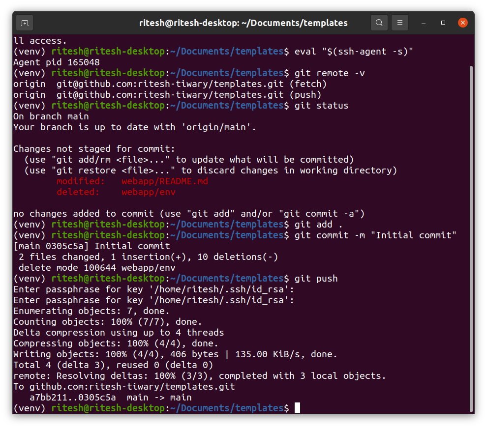

# **streamingapp**
[](https://opensource.org/licenses/MIT)
[](https://github.com/ritesh-tiwary/templates/stargazers)
[](https://github.com/ritesh-tiwary/templates/network/members)
[](https://github.com/ritesh-tiwary/templates/issues)
[](https://github.com/ritesh-tiwary/templates/pulls)
[](https://github.com/ritesh-tiwary/templates/graphs/contributors)
[](https://twitter.com/intent/tweet?text=Wow:&url=https%3A%2F%2Fgithub.com%2Fusername%2Frepository)

```console
ritesh@ritesh-desktop:~/Documents/templates$ conda activate venv
(venv) ritesh@ritesh-desktop:~/Documents/templates$ ssh-keygen -t ed25519 -C "[Ritesh Tiwary]"
(venv) ritesh@ritesh-desktop:~/Documents/templates$ ssh -T git@github.com
(venv) ritesh@ritesh-desktop:~/Documents/templates$ eval "$(ssh-agent -s)"
(venv) ritesh@ritesh-desktop:~/Documents/templates$ ssh-add /home/ritesh/.ssh/id_rsa
(venv) ritesh@ritesh-desktop:~/Documents/templates$ git clone git@github.com:ritesh-tiwary/templates.git
(venv) ritesh@ritesh-desktop:~/Documents/templates$ cd webapp
(venv) ritesh@ritesh-desktop:~/Documents/templates/webapp$ pip install -r requirements.txt
(venv) ritesh@ritesh-desktop:~/Documents/templates$ cd ..
(venv) ritesh@ritesh-desktop:~/Documents/templates$ git remote -v
(venv) ritesh@ritesh-desktop:~/Documents/templates$ git status
(venv) ritesh@ritesh-desktop:~/Documents/templates$ git add .
(venv) ritesh@ritesh-desktop:~/Documents/templates$ git commit -m "Initial commit"
(venv) ritesh@ritesh-desktop:~/Documents/templates$ git push
```
---

---
**`uvicorn app:app --host 127.0.0.1 --port 8000`**


---
